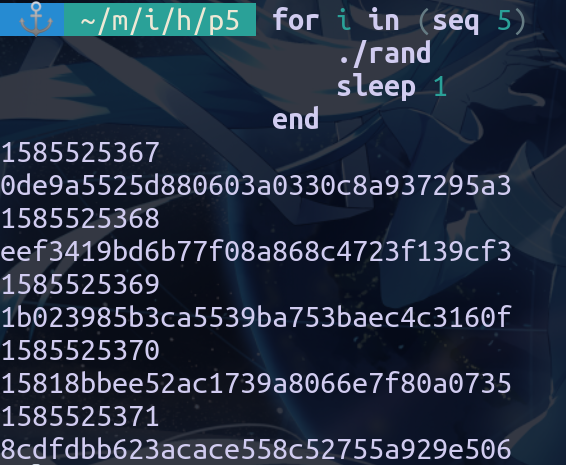
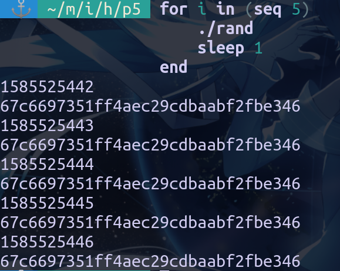
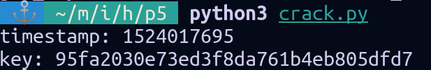
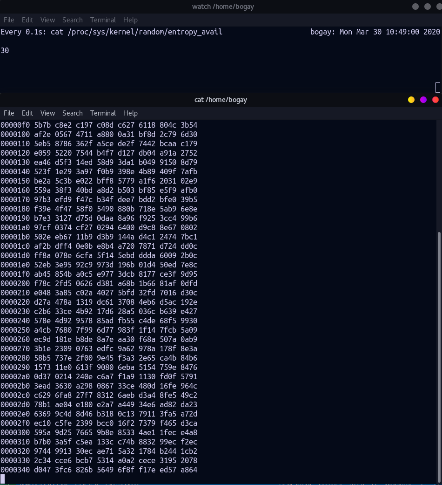
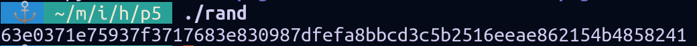

# Information Security HW01

40747019s 莊博傑

## P1

### (1)

$$\begin{aligned} H(X) + H(Y|X) &= -\sum_{x \epsilon X} p(x)\log_2p(x) - \sum_{x \epsilon X, y \epsilon Y} p(x, y) \log_2 p(y|x) \\
&= -\sum_{x \epsilon X} (\sum_{y \epsilon Y} p(x, y)\log_2p(x) + \sum_{y \epsilon Y} p(x, y)\log_2\frac{p(x, y)}{p(x)}) \\
&= -\sum_{x \epsilon X}\sum_{y \epsilon Y} (p(x,y) (\log_2p(x)+\log_2\frac{p(x, y)}{p(x)})) \\
&= -\sum_{x \epsilon X}\sum_{y \epsilon Y} p(x, y)\log_2p(x, y) \\
&= H(X, Y)
\end{aligned}
$$

### (2)

當 $n=2$ 時
$$\begin{aligned}
H(X_1, X_2) &= H(X_1) + H(X_2 | X_1) \\
&= H(X_1) + H(X_2) \\
&= \sum_{i=1}^{n} H(X_i)
\end{aligned}$$
成立

假設當 $n=k$ 時題敘成立，則當 $n=k+1$ 時
$$\begin{aligned}
H(X_1, X_2, \dots, X_{k+1}) &= H(X_1, X_2, \dots, X_k) + H(X_{k+1} | X_1, X_2, \dots, X_k) \\
&= \sum_{i=1}^{k} H(X_i) + H(X_{k+1}) \\
&= \sum_{i=1}^{k+1} H(X_i)
\end{aligned}$$
依然成立，故題敘為真

## P2

### 1. Yes
### 2. No

密文的最後一個 bit 會是 $LSB(m)$ ，可以藉此分辨被加密的 $m$ ，所以此加密方式並不滿足 semantic security

### 3. Yes
### 4. Yes
### 5. No

他直接把 key 接在後面，可以用來解密

## P3

首先，嘗試分析密文內的各字元的頻率，先將最高幾個填上去諸如 *e, a, t* 這種高頻率的字母，此時應該會有部份單字的缺字較少了，將這些單字拿去 dict.org 做查詢 (此網站支援 *regex* 搜尋)，將查到的單字逐漸填進表內。source code 及解出的文章請見 `p3` 這個資料夾

## P4

一開始我是使用 `p4/crack.py` 的方式，詳細描述如下：  
首先建一個表，以 xor 得出來的值作為 key ，可能的明文字元集合作為 value
然後將 challenge ciphertext 拿去跟其餘明文做 xor 得到一些 byte 的序列，這時再對每個位置去查表得到可能的字元集，取這 10 個集合的交集，作為這位置可能的候選  
然而在這時我發現有些位置的結果會是空集合，雖然可以復原出部份明文(`p4/part-plaintext`)，但是似乎難以直接看出完整的訊息  
所以我轉而向彭建霖同學求助，得到另一種解法(`p4/crack-v2.py`)，步驟如下：  
對於任兩組密文，取得他們 xor 過後的序列， 然後取出大寫字母的部份，稱它為 $M$ ，此結果應為一個小寫字母與空格 xor 的結果，所以將 $M$ 轉成小寫，再與那個位置的密文 xor 得到可能的 key 並且將它存起來  
重複上述步驟後，就可以得到一串二維的 list ，每個元素代表的是這位置可能的 key ，所以取每個元素裡次數最多的作為這位置的 key ，將它跟 challenge ciphertext 做 xor 後得到部份明文(`p4/plaintext` 的第一行)
對於其中有缺漏的部份就靠上下文與上網查字典補齊


## P5

### Task1

1. 當使用 `time(NULL)` 作為種子時
   
2. 沒有呼叫 `srand` 時
   

可以發現，如果沒有呼叫 `srand` 的話，每次隨機出來的字串都會是一樣的
在原本的 code 當中，使用了 `time` 作為種子，以確保每次呼叫產生出來的 key 都會不一樣

### Task2

解出得到 key 為 `95fa2030e73ed3f8da761b4eb805dfd7`  
產生時間應為 `2018/4/17 22:14:55 (UTC-4)`
  
實做方式是先使用 `C` 寫出產生 key 的 function ，然後再由 python 這邊呼叫，具體來說就是算出可能的時間區間後嘗試每個 key 的可能性

### Task3

整體來說在數字小的時候增長較快，到接近 4000 時則幾乎不會有大的變動
根據題本總共實驗以下五種動作

1. 移動滑鼠：看起來似乎是增長最快的方式，雖然說在數字大的時候感覺不大，但當 entropy 低落時，動動滑鼠就能使它快速上升
2. 點擊滑鼠：看起來影響不算很大，推測是因為點擊的動作較零散，無法提供足夠多的亂度
3. 打字：感覺與點擊滑鼠相差不大
4. 讀檔：在讀非常大的檔案的時候整體 entropy 會上升挺多，然而上升的速率似乎不會比移動滑鼠快很多
5. 瀏覽網頁：感覺與點擊滑鼠的差異也不大，雖然說在瀏覽網頁時也能看到 entropy 增長的較迅速，但我想應該是滑鼠移動 + 點擊的影響

### Task4

#### 觀察 entropy



在實驗過程中，可以發現當 entropy 降到大約 60 以下，的時候 `hexdump` 的輸出就會卡住，然後滑鼠隨機移動時 entropy 會快速上升到約莫 60 左右時再降至接近 0 的值，並且看到新的一行隨機的 16 個 bytes 被產生出來

#### 如何執行 DOS 攻擊

假設服務需要使用 `/dev/random` 產生 session key 的話，只要大量發出請求， entropy 自然會降至無法生出新的 key ，因此其他人的請求就會被阻塞

### Task5

#### Ent 測試

運行以下指令
```bash
head -c 1M /dev/urandom > output.bin
ent output.bin
```
得到輸出
```
Entropy = 7.999834 bits per byte.

Optimum compression would reduce the size
of this 1048576 byte file by 0 percent.

Chi square distribution for 1048576 samples is 241.16, and randomly
would exceed this value 72.40 percent of the times.

Arithmetic mean value of data bytes is 127.6711 (127.5 = random).
Monte Carlo value for Pi is 3.141392294 (error 0.01 percent).
Serial correlation coefficient is -0.000620 (totally uncorrelated = 0.0).
```
嘗試與 C 的 `rand` 來做比較，先產生 1M 的隨機資料，使用 `ent` 分析後得到以下輸出
```
Entropy = 7.999832 bits per byte.

Optimum compression would reduce the size
of this 1048576 byte file by 0 percent.

Chi square distribution for 1048576 samples is 243.93, and randomly
would exceed this value 68.00 percent of the times.

Arithmetic mean value of data bytes is 127.5626 (127.5 = random).
Monte Carlo value for Pi is 3.138439707 (error 0.10 percent).
Serial correlation coefficient is 0.000544 (totally uncorrelated = 0.0).
```
將兩份輸出的比較做成表格
| indicator           | `/dev/urandom` | C `rand` |
| ------------------- | -------------- | -------- |
| Entropy (bits/byte) | 7.999834       | 7.999832 |
| Chi square          | 241.16         | 243.93   |
| Mean                | 127.6711       | 127.5626 |
| Monte Carlo error   | 0.01%          | 0.1%     |
| Serial correlation  | -0.000620      | 0.000544 |
以這次比較來看，使用 C 的 `rand` 似乎表現上是稍微差了一些，以蒙地卡羅法求 $\pi$ 值的誤差大約 10 倍之多，但後來自己再手動執行幾次，有時候 C 的 `rand` 表現也是不錯的

#### 使用 `/dev/urandom` 產生 key

source code
```c
#include <stdio.h>
#include <stdlib.h>
#define KEYSIZE 32 // 256 bits

int main()
{
    unsigned char key[KEYSIZE];
    // read random bytes
    FILE *random = fopen("/dev/urandom", "r");
    fread(key, sizeof(unsigned char) * KEYSIZE, 1, random);
    fclose(random);
    // print key
    for (int i = 0; i < KEYSIZE; i++)
        printf("%.2x", key[i]);
    puts("");
    return 0;
}
```
結果
